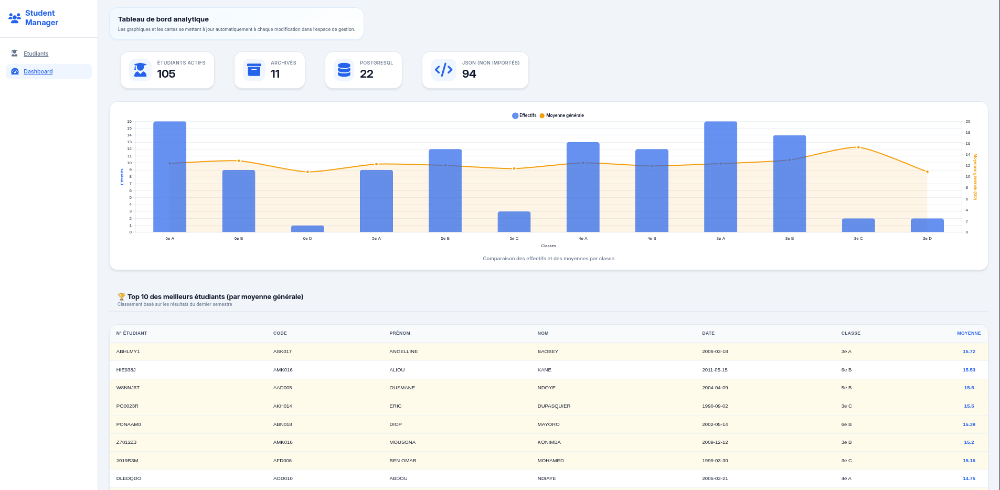
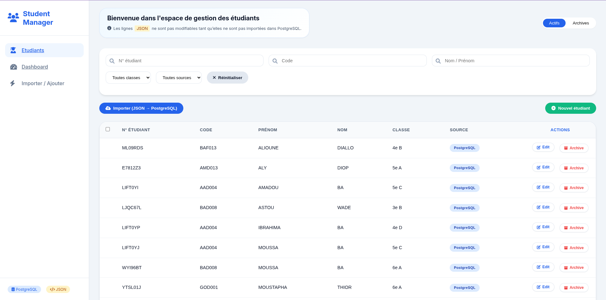
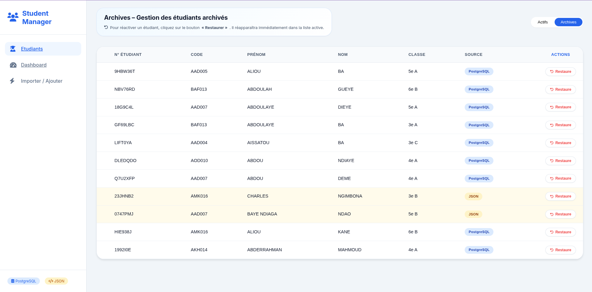

[](https://github.com/yba01/student-management-dashboard/blob/main/README.md)
# Student Management Dashboard

A full-stack web application for managing students, academic records, and educational statistics.

Built with **FastAPI**, **PostgreSQL**, and **Vanilla JavaScript**, the project provides student management features, data visualization dashboards, search and filtering capabilities, and automated testing.

---

## Overview

Student Management Dashboard is designed to simulate a real-world academic management system.

The application allows users to:

- Import student data from JSON files
- Create and manage student records
- Archive and restore students
- Search and filter large datasets
- Visualize academic statistics through a dashboard
- Analyze class performance and student rankings

The project follows a clean architecture with a clear separation between frontend, backend, services, database access, and testing.

---

## Features

### Student Management

- Import students from `valid.json`
- Create new students
- Update existing students
- Archive students
- Restore archived students
- View student details

### Search & Navigation

- Search students by keyword
- Filter by class
- Filter by data source
- Infinite scrolling using Intersection Observer

### Dashboard & Analytics

- Total number of students
- Students imported from PostgreSQL
- Students imported from JSON
- Active students count
- Archived students count
- Class distribution
- Top 10 students by average grade
- Average grade per class

### Quality Assurance

- Automated API tests using Pytest
- Validation with Pydantic
- Structured API design

---

## Tech Stack

### Backend

- FastAPI
- PostgreSQL
- Pydantic
- Pytest
- Psycopg

### Frontend

- HTML5
- CSS3
- Vanilla JavaScript
- Intersection Observer API
- Chart.js

---

## Project Structure

```text
student-management-dashboard/
│
├── backend/
│   ├── app/
│   │   ├── routes/
│   │   ├── services/
│   │   ├── database/
│   │   ├── schema/
│   │   ├── utils/
│   │   └── main.py
│   │
│   └── tests/
│
├── frontend/
|   ├── css/
│   ├── js/
│   └── pages/
│
├── sql/
│   └── schema.sql
│
├── script/
│
├── docs/
│   ├── students.png
│   ├── dashboard.png
│   └── archive.png
│
├── requirements.txt
├── .env.example
└── README.md
```

---

## Database Schema

### Tables

#### etudiants

Stores student information.

#### notes

Stores academic grades associated with students.

---

## API Endpoints

### Student Routes

| Method | Endpoint | Description |
|----------|------------|-------------|
| POST | `/api/v1/import/json` | Import JSON data |
| GET | `/api/v1/etudiants` | List students |
| GET | `/api/v1/etudiants/{numero}` | Get a student |
| POST | `/api/v1/etudiants` | Create a student |
| PATCH | `/api/v1/etudiants/{numero}` | Update a student |
| PATCH | `/api/v1/etudiants/{numero}/archive` | Archive a student |
| PATCH | `/api/v1/etudiants/{numero}/restore` | Restore a student |

### Statistics Routes

| Method | Endpoint | Description |
|----------|------------|-------------|
| GET | `/api/v1/stats/globales` | Global statistics |
| GET | `/api/v1/stats/top-moyeennes` | Top 10 students |
| GET | `/api/v1/stats/classe` | Statistics by class |

---

## Screenshots

### Dashboard



### Students Management



### Archive Management



---

## Installation

### Clone Repository

```bash
git clone https://github.com/yba01/student-management-dashboard.git

cd student-management-dashboard
```

---

### Backend Setup

Create a virtual environment:

```bash
python -m venv venv
```

Activate environment:

Linux/macOS:

```bash
source venv/bin/activate
```

Windows:

```bash
venv\Scripts\activate
```

Install dependencies:

```bash
pip install -r requirements.txt
```

---

### Environment Variables

Create a `.env` file from `.env.example`.

```env
DB_HOST=localhost
DB_NAME=db
DB_PORT=5432
DB_USER=postgres
DB_PASSWORD=your_password
```

---

### Database Setup

Create PostgreSQL database.

Execute:

```bash
psql -U postgres -d db -f sql/schema.sql
```

---

### Run Backend

```bash
uvicorn app.main:app --reload
```

API available at:

```text
http://localhost:8000
```

Swagger documentation:

```text
http://localhost:8000/docs
```

---

### Run Frontend

```bash
cd frontend

python -m http.server 5500
```

Frontend available at:

```text
http://localhost:5500
```

---

## Testing

Run all tests:

```bash
pytest
```

Current coverage includes:

- Get students
- Get single student
- Student not found
- Create student
- Archive student
- Restore student

---

## Design Principles

- Clean project structure
- Separation of concerns
- Service layer architecture
- RESTful API design
- Environment-based configuration
- Reproducible database setup
- Automated testing

---

## Future Improvements

- Authentication & Authorization
- Docker deployment
- CI/CD pipeline
- Role-based access control
- Export to Excel/PDF
- Advanced dashboard analytics

---

## Author

**Yba (yba01)**

GitHub: https://github.com/yba01

---

## Recruiter Highlights

This project demonstrates:

- Backend API development with FastAPI
- Relational database design using PostgreSQL
- SQL querying and aggregation
- REST API architecture
- Data validation with Pydantic
- Automated testing with Pytest
- Frontend development with Vanilla JavaScript
- Dashboard and data visualization
- Clean project organization
